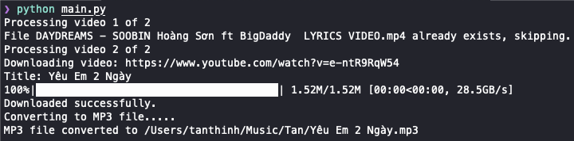
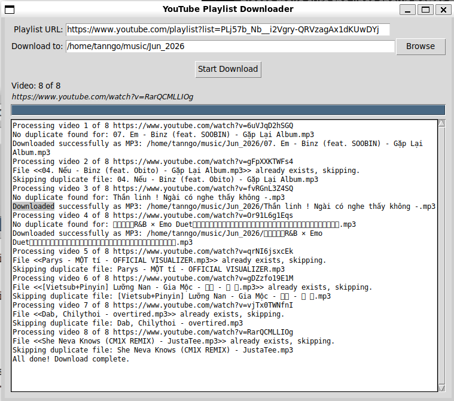

# Ytplaylist - Download and convert YouTube playlist to MP3


Python script to download a YouTube playlist and convert it to MP3.

Version: v0.4.0

---

## Shortcuts

- [Ytplaylist - Download and convert YouTube playlist to MP3](#ytplaylist---download-and-convert-youtube-playlist-to-mp3)
  - [Shortcuts](#shortcuts)
  - [Quick Start](#quick-start)
  - [Installation](#installation)
  - [Usage](#usage)
    - [CLI version](#cli-version)
    - [GUI version](#gui-version)
  - [Example config.json](#example-configjson)
  - [Configuration](#configuration)
  - [Project structure](#project-structure)
  - [Features](#features)
  - [Requirements & Dependencies](#requirements--dependencies)
  - [Troubleshooting](#troubleshooting)
  - [Contributing](#contributing)
  - [Changelog](#changelog)
  - [License](#license)

## Quick Start

```sh
git clone https://github.com/titango/ytplaylist.git
cd ytplaylist
./setup.sh
# Edit config.json as needed, then:
python main.py              # CLI version
# --- or ---
python -m gui.app           # GUI version
```

---

## Installation
1. Clone the repository to your local machine.
2. Navigate to the cloned repository's directory.
3. Run `setup.sh` to set up the Python environment and install the necessary dependencies.
4. Configure `config.json` with your `DOWNLOAD_DIR` and `YOUTUBE_PLAYLIST` — the CLI reads it directly, and the GUI loads/saves it automatically through the application window.

---

## Usage

### CLI version
Run `python main.py` (or `python -m cli.main`) after configuring `config.json`.



### GUI version
Run `python -m gui.app` to launch the desktop window.

The GUI provides:
- **Playlist URL** and **Download directory** fields with a **Browse** button.
- **Start Download / Cancel** button to begin or stop a download.
- **Video counter** ("Video 3 of 15") and **per-video progress bar**.
- **Scrolling log area** showing every download step.
- **Auto-save** — your settings persist between sessions.


---

## Configuration

### CLI (`config.json`)
- `DOWNLOAD_DIR`: The directory where the downloaded YouTube videos will be stored.
- `YOUTUBE_PLAYLIST`: The URL of the YouTube playlist you wish to download.

### GUI
Same `config.json` — loaded on startup, saved when you click **Start** or close the window.

---

## Project structure

```
ytplaylist/
╠═ cli/                  # CLI entry point
║   ╠═ __init__.py
║   ╚═ main.py           # Run with: python -m cli.main
╠═ gui/                  # GUI application
║   ╠═ __init__.py
║   ╠═ app.py            # Tkinter main window
║   ╚═ worker.py         # Background download thread
╠═ lib/                  # Core download logic (shared)
║   ╠═ __init__.py
║   ╠═ yt_dlp.py         # Playlist & per-video download
║   ╚═ file.py           # Filename sanitization, duplicates, logging
╠═ tests/                # Pytest test suite
║   ╠═ test_file.py
║   ╚═ test_yt_dlp.py
╠═ main.py               # Legacy entry point (delegates to cli/)
╠═ config.json           # CLI config
╠═ requirements.txt
╚═ CLAUDE.md
```

---

## Features

- Downloads videos from a specified YouTube playlist.
- Converts the downloaded videos to MP3 format (192 kbps).
- Saves the MP3 files to the specified download directory.
- Skips unavailable or deleted videos and continues downloading the rest of the playlist.
- Logs every skipped video with a reason for easy troubleshooting.
- Sanitizes video titles so characters like `/` are converted to `-` and never create unwanted subdirectories.
- Use the CLI or the desktop GUI, whichever suits your workflow.
- Shared config — both CLI and GUI use the same `config.json` at the project root.

---

## Requirements & Dependencies

- Python 3.6 or higher
- `yt-dlp` (for downloading and parsing playlists)
- `tqdm` (for progress bar — CLI only; GUI uses its own progress bar)
- `ffmpeg` (system install, for MP3 conversion)
- Tkinter (usually included with Python — no separate install needed)

---

## Troubleshooting

- Make sure your YouTube playlist is set to public.
- If you see `No module named 'yt_dlp'`, run `pip install yt-dlp`.
- If a video in your playlist is unavailable (e.g., the uploader's account was terminated, or the video was removed), it will be **skipped** and the rest of the playlist will continue downloading. Look for `Skipping video N of M: ...` lines in the log to see which entries were skipped and why.
- **GUI doesn't open on WSL?** Install an X server (VcXsrv) or use WSLg on Windows 11. See the [WSL GUI docs](https://learn.microsoft.com/en-us/windows/wsl/tutorials/gui-apps) for setup.
- **"ffmpeg not found" errors?** Install ffmpeg via your system package manager (`sudo apt install ffmpeg` on Debian/Ubuntu).
- **No new dependencies for GUI** — Tkinter is part of the Python standard library; no `pip install` needed.

---

## Contributing

Feel free to fork the repository and submit pull requests. For major changes, please open an issue first to discuss what you would like to change.

---

## Changelog

See [CHANGELOG.md](CHANGELOG.md) for a list of changes and version history.

---

## License

The MIT License (MIT)
Copyright © 2024

Permission is hereby granted, free of charge, to any person obtaining a copy of this software and associated documentation files (the "Software"), to deal in the Software without restriction, including without limitation the rights to use, copy, modify, merge, publish, distribute, sublicense, and/or sell copies of the Software, and to permit persons to whom the Software is furnished to do so, subject to the following conditions:

The above copyright notice and this permission notice shall be included in all copies or substantial portions of the Software.

THE SOFTWARE IS PROVIDED "AS IS", WITHOUT WARRANTY OF ANY KIND, EXPRESS OR IMPLIED, INCLUDING BUT NOT LIMITED TO THE WARRANTIES OF MERCHANTABILITY, FITNESS FOR A PARTICULAR PURPOSE AND NONINFRINGEMENT. IN NO EVENT SHALL THE AUTHORS OR COPYRIGHT HOLDERS BE LIABLE FOR ANY CLAIM, DAMAGES OR OTHER LIABILITY, WHETHER IN AN ACTION OF CONTRACT, TORT OR OTHERWISE, ARISING FROM, OUT OF OR IN CONNECTION WITH THE SOFTWARE OR THE USE OR OTHER DEALINGS IN THE SOFTWARE.
