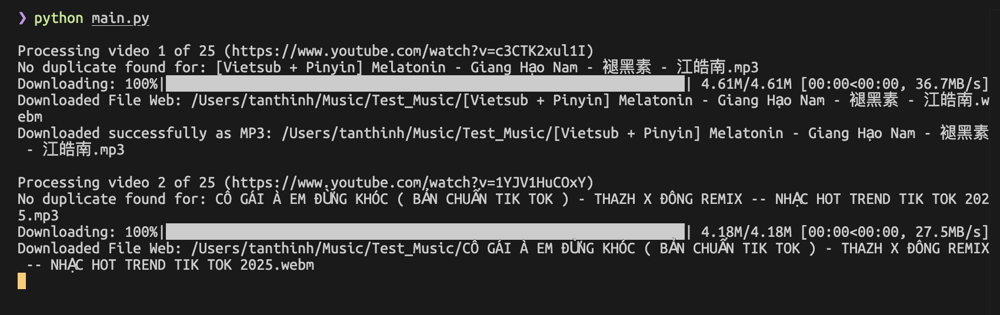

# Ytplaylist - Download and convert YouTube playlist to MP3 v0.2.1


Python script to download a YouTube playlist and convert it to MP3.

---

## Shortcuts

- [Ytplaylist - Download and convert YouTube playlist to MP3 v0.2.1](#ytplaylist---download-and-convert-youtube-playlist-to-mp3-v021)
  - [Shortcuts](#shortcuts)
  - [Quick Start](#quick-start)
  - [Installation](#installation)
  - [Usage](#usage)
  - [Example config.json](#example-configjson)
  - [Configuration](#configuration)
  - [Features](#features)
  - [Requirements \& Dependencies](#requirements--dependencies)
  - [Troubleshooting](#troubleshooting)
  - [Contributing](#contributing)
  - [Changelog](#changelog)
  - [License](#license)

## Quick Start

```sh
git clone https://github.com/titango/ytplaylist.git
cd ytplayer_downloader
./setup.sh
# Edit config.json as needed
python main.py
```

---

## Installation
1. Clone the repository to your local machine.
2. Navigate to the cloned repository's directory.
3. Run `setup.sh` to set up the Python environment and install the necessary dependencies.
4. Edit the `config.json` file to specify your `DOWNLOAD_DIR`, `YOUTUBE_PLAYLIST` according to your system setup.

---

## Usage
- Run `python main.py` after configuring the `config.json` file.



---

## Example config.json

```json
{
  "DOWNLOAD_DIR": "./downloads",
  "YOUTUBE_PLAYLIST": "https://www.youtube.com/playlist?list=...",
}
```

---

## Configuration

- `DOWNLOAD_DIR`: The directory where the downloaded YouTube videos will be stored.
- `YOUTUBE_PLAYLIST`: The URL of the YouTube playlist you wish to download.

---

## Features

- Downloads videos from a specified YouTube playlist.
- Converts the downloaded videos to MP3 format.
- Saves the MP3 files to the specified download directory.

---

## Requirements & Dependencies

- Python 3.6 or higher
- `ffmpeg` for converting videos to MP3 format
- `yt-dlp` (for downloading videos)
- `pytubefix` (for playlist parsing)
- `tqdm` (for progress bar)

Install dependencies:
```sh
pip install yt-dlp tqdm
```

---

## Troubleshooting

- Make sure your YouTube playlist is set to public.
- If you see `No module named 'yt_dlp'`, run `pip install yt-dlp`.
- If you see permission errors, try running the script with elevated privileges or check your download directory permissions.
- Ensure `ffmpeg` is installed and its path is correct in `config.json`.

---

## Contributing

Feel free to fork the repository and submit pull requests. For major changes, please open an issue first to discuss what you would like to change.

---

## Changelog

See [CHANGELOG.md](CHANGELOG.md) for a list of changes and version history.

---

## License

The MIT License (MIT)
Copyright © 2024

Permission is hereby granted, free of charge, to any person obtaining a copy of this software and associated documentation files (the “Software”), to deal in the Software without restriction, including without limitation the rights to use, copy, modify, merge, publish, distribute, sublicense, and/or sell copies of the Software, and to permit persons to whom the Software is furnished to do so, subject to the following conditions:

The above copyright notice and this permission notice shall be included in all copies or substantial portions of the Software.

THE SOFTWARE IS PROVIDED “AS IS”, WITHOUT WARRANTY OF ANY KIND, EXPRESS OR IMPLIED, INCLUDING BUT NOT LIMITED TO THE WARRANTIES OF MERCHANTABILITY, FITNESS FOR A PARTICULAR PURPOSE AND NONINFRINGEMENT. IN NO EVENT SHALL THE AUTHORS OR COPYRIGHT HOLDERS BE LIABLE FOR ANY CLAIM, DAMAGES OR OTHER LIABILITY, WHETHER IN AN ACTION OF CONTRACT, TORT OR OTHERWISE, ARISING FROM, OUT OF OR IN CONNECTION WITH THE SOFTWARE OR THE USE OR OTHER DEALINGS IN THE SOFTWARE.